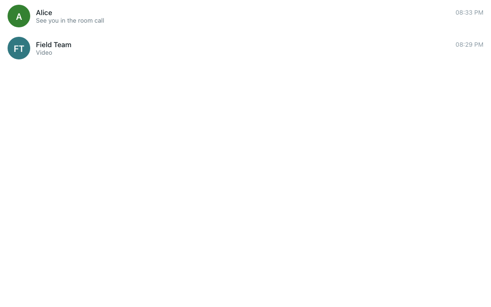
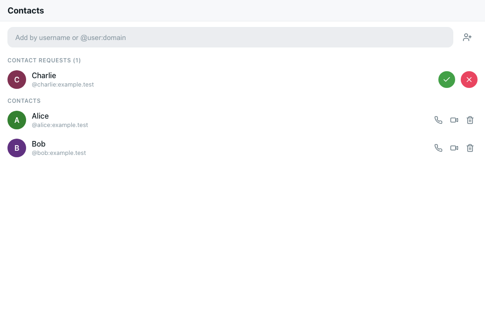
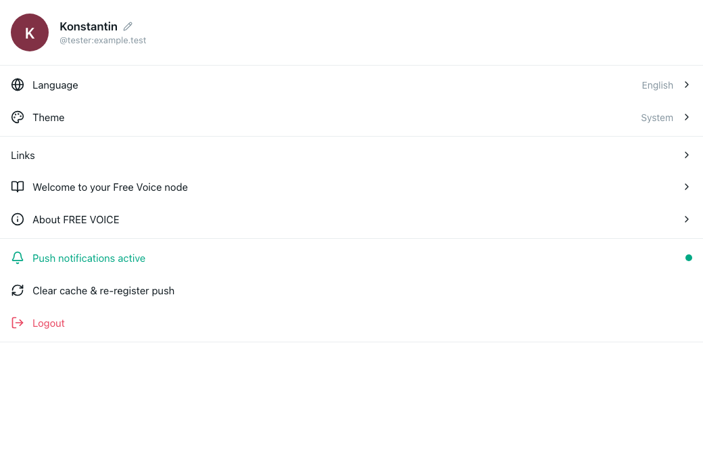
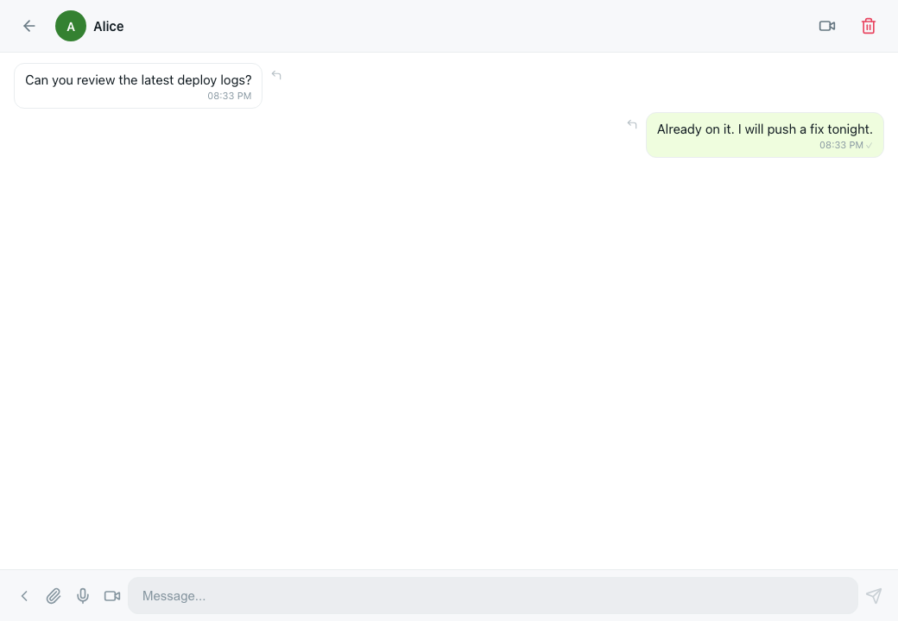
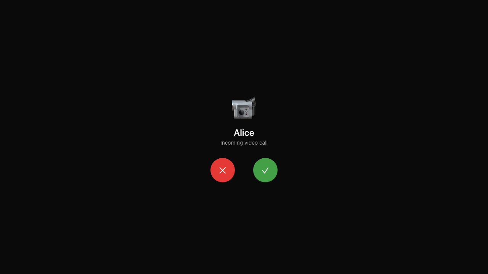
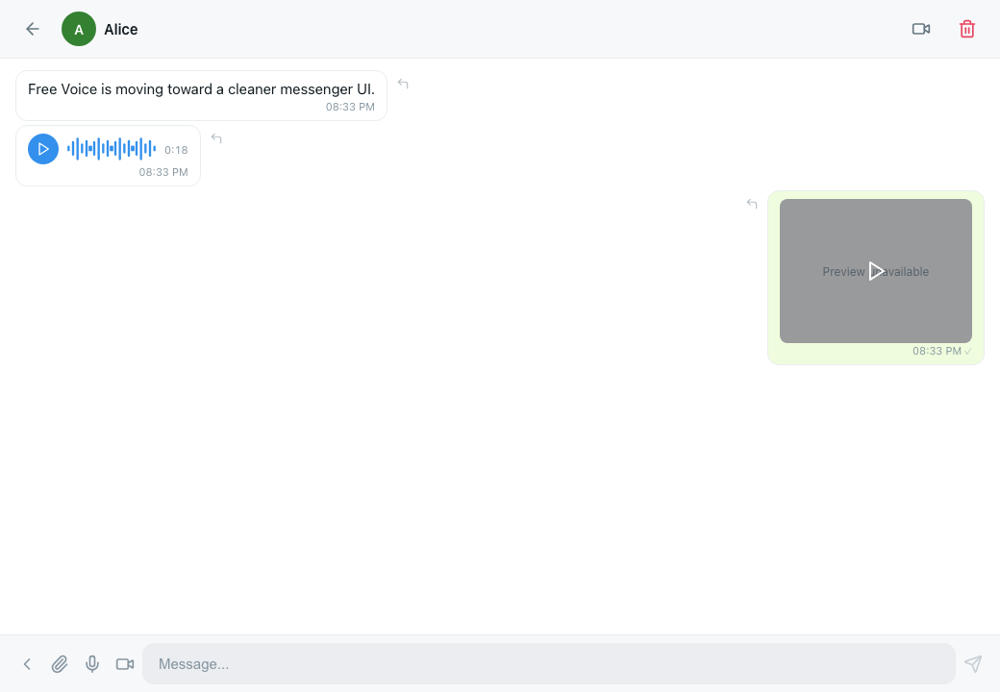

# Free Voice

## English

Free Voice is a private, self-hostable communication stack for people who want to own their own communication infrastructure without leaving the wider network. It started as a VoIP-first project, but its current direction is shaped by Matrix, because the protocol fits freedom, interoperability, and resilience better than a closed stack.

I do not want another Slack- or Discord-like interface. The target is a messenger-first experience: simple, fast, friendly, Telegram-like in usability, but built for ownership, federation, and survivability. This project is not designed to cause harm. It is designed to support freedom of speech, autonomy, and durable communication.

**North star**

> Build a global, resilient, and private communication system in which every person can own their own communication infrastructure while still remaining part of a shared network. Free Voice is a next-generation communication network built on trust, privacy, and decentralization.

## Architecture

- `client/`: Svelte client, messenger-first UI, unit tests, local/real E2E
- `backend/`: FastAPI service, Matrix integration, auth/messaging/call-control APIs, backend tests
- `ansible/`: deployment, inventory, playbooks, systemd-managed services
- `openspec/`: authoritative current-state specs and active change proposals

Current runtime direction:
- Matrix for identity, messaging, and federation
- FastAPI for product logic and service integration
- Dendrite for homeserver operation
- LiveKit and the remaining media stack for real-time calls
- Ansible for repeatable deployment

Treat [openspec/specs](openspec/specs) as the only current-state documentation tree.

## Screenshots

| Chats | Contacts |
| --- | --- |
|  |  |

| Settings | P2P chat |
| --- | --- |
|  |  |

| Call view | Audio and video messages |
| --- | --- |
|  |  |

## Setup

```bash
cp config.yml.example config.yml
make setup
```

- Keep `config.yml` local and untracked
- Keep secrets in `ansible/inventory/group_vars/all/vault.yml`
- Use [`.env.template`](.env.template) for publishable examples only

Validation:

```bash
make validate
cd client && npm run check && npm run test:unit
cd backend && uv run pytest
```

Deployment entry points live in [ansible/README.md](ansible/README.md) and [Makefile](Makefile).

Current deployment note:
- the live service currently runs on a free DuckDNS domain
- that setup is simple and convenient, but it is also limited and less stable than running on your own proper domain

## Roadmap

- audio and video message transcription inside chats
- waveform preview and visible duration for audio messages by default
- registration by email and phone number, both optional
- user search by username, email, phone, and display name
- avatar support
- profile and about-me page with avatar, display name, phone, and email editing
- local media size tracker with clean-all action
- edit and delete messages
- group chat UI and group call support
- saved messages UI
- localisation
- federation-mode support in the UI
- federation-mode backend validation

## Support

- try it
- install it
- find flaws and bugs
- fix something and submit a PR
- buy me a coffee

Bitcoin:
`bc1q64zk6rp6lfrmjgkxx4pc7vtadm34ty6nmdq02weq85yzdhp2msesye8q4z`


## Русский

Free Voice — это приватная, self-hosted система связи для людей, которые хотят владеть своей коммуникационной инфраструктурой и при этом оставаться частью общей сети. Проект начинался как VoIP-стек, но его текущее направление опирается на Matrix, потому что этот протокол лучше подходит для свободы, совместимости и устойчивости.

Мне не нужен очередной UI в стиле Slack или Discord. Цель — messenger-first опыт: простой, быстрый, дружелюбный, ближе к Telegram по удобству, но построенный вокруг владения, федерации и устойчивости. Этот проект никогда не задумывался для причинения вреда. Его цель — поддержка свободы слова, автономии и надёжной связи.

**Северная звезда**

> Создать глобальную, устойчивую и приватную систему связи, в которой каждый может владеть своей коммуникационной инфраструктурой и при этом оставаться частью единой сети. Free Voice — это коммуникационная сеть нового поколения, построенная на доверии, приватности и децентрализации.

## Архитектура

- `client/`: Svelte-клиент, messenger-first UI, unit-тесты, local/real E2E
- `backend/`: FastAPI-сервис, интеграция с Matrix, API для auth/messaging/call-control, backend-тесты
- `ansible/`: деплой, inventory, playbooks, systemd-managed сервисы
- `openspec/`: единственный источник актуальных спецификаций и активных change proposal

Текущее технологическое направление:
- Matrix для identity, messaging и federation
- FastAPI для продуктовой логики и сервисных интеграций
- Dendrite как homeserver
- LiveKit и остальной media stack для real-time звонков
- Ansible для повторяемого деплоя

Считайте [openspec/specs](openspec/specs) единственным актуальным деревом документации.

## Скриншоты

| Чаты | Контакты |
| --- | --- |
|  |  |

| Настройки | Личный чат |
| --- | --- |
|  |  |

| Экран звонка | Аудио- и видеосообщения |
| --- | --- |
|  |  |

## Установка

```bash
cp config.yml.example config.yml
make setup
```

- Держите `config.yml` локальным и неотслеживаемым
- Держите секреты в `ansible/inventory/group_vars/all/vault.yml`
- Используйте [`.env.template`](.env.template) только как публичный пример

Проверка:

```bash
make validate
cd client && npm run check && npm run test:unit
cd backend && uv run pytest
```

Точки входа для деплоя описаны в [ansible/README.md](ansible/README.md) и [Makefile](Makefile).

Текущая заметка по деплою:
- сейчас сервис работает на бесплатном домене DuckDNS
- это очень просто и удобно для старта, но такой вариант ограничен и менее стабилен, чем собственный полноценный домен

## Дорожная карта

- транскрибация аудио- и видеосообщений внутри чатов
- waveform-preview и видимая длительность аудиосообщений по умолчанию
- регистрация по email и номеру телефона, оба поля опциональны
- поиск пользователя по username, email, phone и display name
- поддержка аватаров
- страница профиля и about me: смена аватара, display name, phone и email
- локальный трекер размера медиа и кнопка очистки
- редактирование и удаление сообщений
- UI для групповых чатов и поддержка групповых звонков
- UI для saved messages
- локализация
- поддержка federation mode в UI
- backend-проверка federation mode

## Поддержка

- установите проект
- ищите баги и ошибки
- исправляйте и присылайте PR
- купите мне кофе ;)

Bitcoin:
`bc1q64zk6rp6lfrmjgkxx4pc7vtadm34ty6nmdq02weq85yzdhp2msesye8q4z`


